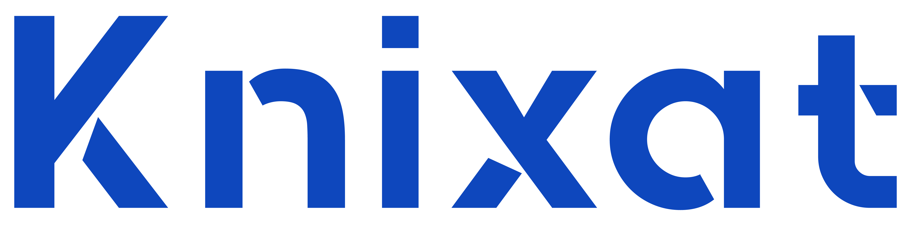

[Home](../README.md) | [Sprint 1](README.md)

---

    

# Knixat Cloud DevOps - Sprint 7

## Evaluate, compare, and document the performance and cost implications of different Azure storage types (Blob, File share, Queues, Tables) for a common use case

| Azure Storage Type | Performance | Cost |
| --- | --- | --- |
| **Blob Storage** | Blob storage is massively scalable and secure object storage. It is used for streaming and storing documents, videos, pictures, backups, and other unstructured text or binary data. It provides hot, cool, and archive storage tiers for different use cases. | The total cost of block blob storage depends on the volume of data stored per month, the quantity and types of operations performed, along with any data transfer costs. |
| **File Share Storage** | Azure File Share provides fully managed file shares in the cloud that are accessible via the industry-standard Server Message Block (SMB) protocol. It's designed to be highly available and durable, and it can handle multiple concurrent connections which makes it suitable for various workloads. | The cost of Azure File Share depends on the provisioned size of the share. You pay for the amount of storage you provision irrespective of how much data is stored in the file share. |
| **Queue Storage** | Azure Queue Storage is a service for storing large numbers of messages that can be accessed from anywhere in the world via authenticated calls using HTTP or HTTPS. It provides asynchronous message queueing for communication between application components. | With Azure Queue Storage, you only pay for what you use. The cost is based on the capacity used, transactions performed, and data transfer costs. |
| **Table Storage** | Azure Table Storage is a service that stores structured NoSQL data in the cloud. It provides a key-attribute store with a schema-less design. | The cost of Table Storage is based on the amount of data stored in tables and transactions performed against that data. |

---

    

**Contact Us:**  
Email: [admissions@knixat.com](mailto:admissions@email.com)  
Website: [www.knixat.com](https://www.knixat.com)

&copy; 2023 Knixat. All Rights Reserved.

---

[Home](../README.md) | [Sprint 1](README.md)
